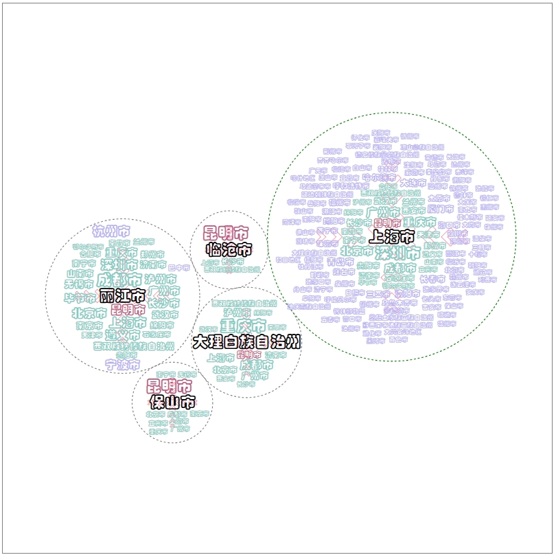

## 空间交互标签云布局库（SitcLib）

### 目录

- [简介](#简介)
- [基本使用](#基本使用)
  - [使用script标签导入](#使用script标签导入)
  - [使用esm标签导入](#使用esm标签导入)
- [前置概念](#前置概念)
  - [默认配置](#默认配置)
  - [空间交互数据](#空间交互数据)
  - [空间交互标签云模式](#空间交互标签云模式)
    - [1.单中心模式](#1.单中心模式)
    - [2.双中心模式](#2.双中心模式)
    - [3.多中心模式](#3.多中心模式)
- [API](#API)
  - [**_sitc_**.data()](#sitcdata())
  - [**_sitc_**.setMode()](<#sitc.setMode()>)
  - [**_sitc_**.setDirection()](<#sitc.setDirection()>)
  - [**_sitc_**.setArrow()](<#sitc.setArrow()>)
  - [**_sitc_**.setColorScheme()](<#sitc.setColorScheme()>)
  - [**_sitc_**.setFont()](<#sitc.setFont()>)
  - [**_sitc_**.setShow()](<#sitc.setShow()>)
  - [**_sitc_**.spiral()](<#sitc.spiral()>)
  - [**_sitc_**.svg()](<#sitc.svg()>)
  - [**_sitc_**.setInteraction()](<#sitc.setInteraction()>)
  - [**_sitc_**.layout()](<#sitc.layout()>)
- [测试用例中的SITC](#测试用例中的SITC)

### 简介

**SitcLib** 是用于绘制空间交互标签云（Spatial Interaction Tag Cloud, SITC）的 JavaScript 库，它依赖于[D3.js](https://d3js.org/)，使用 SVG 绘制 SITC。

### 基本使用

**SitcLib**内部依赖于 D3.js,使用时需要导入 D3.js。

#### 使用 script 标签导入

```html
<!DOCTYPE html>
<html lang="en">
  <head>
    <meta charset="UTF-8" />
    <meta name="viewport" content="width=device-width, initial-scale=1.0" />
    <title>umd版本演示</title>
    <link rel="stylesheet" href="./style.css" />
    <!-- 导入d3 -->
    <script src="https://cdn.bootcdn.net/ajax/libs/d3/7.9.0/d3.min.js"></script>
    <!-- 导入Sitc -->
    <script src="../dist/sitclib.umd.js"></script>
  </head>
  <body>
    <!-- 指定画布，SITC算法默认选择id为sitc-svg的svg元素作为画布 -->
    <svg id="sitc-svg"></svg>
    <script>
      // 实例化sitc对象
      const sitc = new Sitc();

      // 这里使用D3读取空间交互数据
      d3.json("../testData/flightsData.json").then((sourceData) => {
        sitc
          .data([sourceData[0]]) // 指定空间交互数据
          .layout(); // 基于默认配置生成空间交互标签云
      });
    </script>
  </body>
</html>
```

#### 使用 esm 导入

可以通过 npm 下载 es 版本的**SitcLib**，也可以将 dist 文件下的**sitclib.es.js**直接下载到本地。

```she
npm install sitclib
```

```html
<!DOCTYPE html>
<html lang="zh">
  <head>
    <meta charset="UTF-8" />
    <meta name="viewport" content="width=device-width, initial-scale=1.0" />
    <title>es版本演示</title>
    <link rel="stylesheet" href="./style.css" />
  </head>
  <body>
    <!-- 指定画布，SITC算法默认选择id为sitc-svg的svg元素作为画布 -->
    <svg id="sitc-svg"></svg>
  </body>
  <script type="module">
    import * as d3 from "d3";
    import Sitc from "sitclib"; // 导入Sitc

    // 或下载到本地后导入
    // import Sitc from "path/to/sitclib.es.js";

    //实例化得到sitc对象
    const sitc = new Sitc();

    // 使用D3读取空间交互数据
    d3.json("../testData/flightsData.json").then((sourceData) => {
      sitc.data([sourceData[0]]).layout();
    });
  </script>
</html>
```

### 前置概念

#### 默认配置

SitcLib 默认导出**Sitc**类，实例化该类得到一个具有绘制 SITC 默认配置的 **_sitc_** 对象，具体配置如下：

```js
{
  // 参数名：默认值
  sidata: null, // 布局所需的空间交互数据
  mode: 'S1', // 空间交互标签云模式，可选值: 'S1' | 'S2' | 'D1' | 'D2' | 'M'
  direction: 'totalValue', // 空间交互方向，可选值： 'totalValue' | 'inValue' | 'outValue'
  // 指向箭头相关配置
  arrow: {
    show: true, // 是否显示指向箭头
    stroke: { // 箭头描边样式
      color: "#333", // 颜色
      opacity: 0.8, // 透明度
      width: 1, // 宽度
    }
  },
  // 标签配色，分别对应中心、共有、部分共有、独有标签
  colorScheme: ["red", "green", "yellow", "blue"],
  // 标签字体配置
  font: {
    fontSizeRange: [16, 40], // 字号范围
    fontSizeScale: "global", // 字号映射尺度，可选值：'global' | 'local'
    fontFamily: "微软雅黑",  // 字体
    fontWeight: "normal",  // 字重，可选值：'normal' | 'bold'
    fontStyle: "normal", // 倾斜， 可选值：'normal' | 'italic'
  },
  // 显示、隐藏标签簇外接圆和标签包围盒
  isShow: {
    circle: false, // 外接圆
    rect: false, // 包围盒
  },
  // 阿基米德螺线配置
  spiralCfg: {
    ratio: 1, // 螺线长宽比，取值范围[0.5, 1.5]
    step: 0.1, // 步长，取值范围[0.01, 1]
    b: 1, // 螺距，取值范围[0.1, 1.5]
    a: 0, // 起始点偏移量, 固定为0
  },
  // SVG画布的css选择器
  svgSelector: '#sitc-svg',
  // SVG画布
  svgSelection: Selection
}
```

#### 空间交互数据

**SITC**布局所需的数据，具体格式如下：

```js
[
  // 一个中心地点对应的空间交互数据
  {
    // 中心地点
    source: {
      name: string, // 中心地点名称
      crd: [number, number], // 中心地点地理坐标
      province: string, // 中心地点所属省份
      nameEn: string, // 中心地点英文名称
    },
    // 与中心地点交互的地点集合
    targets: [
      {
        name: string, // 地点名称
        crd: [number, number], // 地点地理坐标
        province: string, // 地点所属省份
        nameEn: string, // 地点英文名称
        inValue: number, // 该地点流入中心地点的交互强度
        outValue: number, // 中心地点流出到该地点的交互强度
        totalValue: number, // 流入与流出强度总和
        class?: number, // 地点的尺度[可选参数，仅S1模式可用]，将targets中的地点按class分为不同的尺度，可选值: 1 | 2 | 3
      },
      ...
    ]
  },
  ...
]
```

空间交互数据示例如下：

```json
{
  {"source": {
    "name": "上海市",
    "crd": [121.4737021, 31.2303904],
    "province": "上海市",
    "nameEn": "ShangHaiShi"
  },
  "targets": [
    {
      "name": "临沧市",
      "nameEn": "LinCangShi",
      "crd": [100.088824, 23.884154],
      "province": "云南省",
      "inValue": 2,
      "outValue": 1,
      "totalValue": 3
    },
    {
      "name": "丽江市",
      "nameEn": "LiJiangShi",
      "crd": [100.22775, 26.855047],
      "province": "云南省",
      "inValue": 7,
      "outValue": 7,
      "totalValue": 14
    }
  ]
  },
  {
  "source": {
      "name": "保山市",
      "crd": [
        99.16176100000001,
        25.112046
      ],
      "province": "云南省",
      "nameEn": "BaoShanShi"
    },
    "targets": [
      {
        "name": "上海市",
        "nameEn": "ShangHaiShi",
        "crd": [
          121.4737021,
          31.2303904
        ],
        "province": "上海市",
        "inValue": 1,
        "outValue": 1,
        "totalValue": 2
      },
      {
        "name": "昆明市",
        "nameEn": "KunMingShi",
        "crd": [
          102.832891,
          24.880095
        ],
        "province": "云南省",
        "inValue": 34,
        "outValue": 35,
        "totalValue": 69
      },
      {
        "name": "北京市",
        "nameEn": "BeiJingShi",
        "crd": [
          116.4073963,
          39.90419989999999
        ],
        "province": "北京市",
        "inValue": 1,
        "outValue": 1,
        "totalValue": 2
      },
    ]
  }
}
```

#### 空间交互标签云模式

空间交互标签云设计有**单中心** 、**双中心** 与**多中心** 三种模式，每种模式支持输出的空间交互数据的中心地点数量与应用场景不同。

**1.单中心模式**

单中心模式支出输入一个中心地点的空间交互数据，细分为**单中心同尺度(S1)** 与**单中心不同尺度(S2)** 两种模式。

**单中心同尺度(S1)** 用于展示一个中心地点与同一尺度的其他地点的空间交互情况；
**单中心不同尺度(S2)** 用于展示一个中心地点与不同尺度的其他地点的空间交互情况，**_注意，需要指定空间交互数据中 targets 里地点的 class 属性_** 。

**2.双中心模式**

双中心模式又细分为**双中心同流向(D1)** 与**双中心不同流向(D2)** 两种模式。

**双中心同流向(D1)** 需要输入两个中心地点交互数据，对比这两个地点流入（inValue）、流出(outValue)或总和(totalValue)的交互情况；
**双中心不同流向(D2)** 需要输入一个中心地点的交互数据，对比这一个地点作为交互流入地与流出地的交互情况。

**3.多中心模式**

**多中心模式(M)** 支持输入任意数量中心地点的空间交互数据，展示这些地点空间交互情况。

### API

#### _sitc_.data()

**用途：** 指定空间交互数据。**_注意：_**指定的空间交互数据中的中心地点数量需要和模式对应，S1、S2、D2 模式支持一个中心地点，D1 模式支持两个中心地点，M 模式支持任意数量的中心地点。

**默认值：** null

**返回值：** sitc 对象

```js
const sidata1 = [...];
const sitc = new Sitc(sidata1); // 实例化时可以传入空间交互数据
const sidata2 = [...];
sitc.data(sidata2); // 重新指定空间交互数据
```

#### _sitc_.setMode()

**用途：** 指定空间交互模式,必须为"S1", "S2", "D1", "D2", "M"中的一种。

**默认值：**"S1"

**返回值：** sitc 对象

```js
const sitc = new Sitc(); // 实例化
sitc.setMode("M"); // 指定为多中心模式
```

#### _sitc_.setDirection()

**用途：** 指定空间交互的方向,必须为"totalValue", "inValue", "outValue"中的一种。

**默认值：** "totalValue"

**返回值：** sitc 对象

```js
const sitc = new Sitc(); // 实例化
sitc.setMode("inValue"); // 指定为交互方向为"inValue"
```

#### _sitc_.setArrow()

**用途：** 指定空间交互标签云中指向箭头的相关配置。

**默认值：**

```js
{
  show: true, // 是否显示指向箭头, boolean类型
    stroke: { // 箭头描边样式
      color: "#333", // 颜色
      opacity: 0.8, // 透明度， number类型， 取值范围[0，1]
      width: 1, // 宽度， number类型
  }
}
```

**返回值：** sitc 对象

```js
const sitc = new Sitc(); // 实例化
sitc.setArrow({
  stroke: {
    color: "blue",
  },
}); // 修改箭头颜色为蓝色
```

#### _sitc_.setColorScheme()

**用途：** 指定空间交互标签云中标签的配色。

**默认值：**

```js
["red", "green", "yellow", "blue"]; // 分别对应中心、共有、部分共有与独有标签
```

**返回值：** sitc 对象

```js
const sitc = new Sitc(); // 实例化
sitc.setColorScheme(["purple", "rgb(255,255,255)", "#333", "#e6e6e6"]); // 修改箭头颜色为蓝色
```

#### _sitc_.setFont()

**用途：** 指定空间交互标签云中标签文本相关配置。

**默认值：**

```js
{
  fontSizeRange: [16, 40], // 字号范围
  fontSizeScale: "global", // 字号映射尺度，可选值：'global' | 'local'
  fontFamily: "微软雅黑",  // 字体
  fontWeight: "normal",  // 字重，可选值：'normal' | 'bold'
  fontStyle: "normal", // 倾斜， 可选值：'normal' | 'italic'
}
```

**返回值：** sitc 对象

```js
const sitc = new Sitc(); // 实例化
sitc.setFont({
  fontFamily: "楷体",
  fontWeight: "bold",
}); // 指定字体为楷体并加粗
```

#### _sitc_.setShow()

**用途：** 指定标签簇外接圆与文本标签矩形包围盒是否可见。

**默认值：**

```js
{
  circle: false, // 外接圆，boolean类型
  rect: false // 包围盒，boolean类型
}
```

**返回值：** sitc 对象

```js
const sitc = new Sitc(); // 实例化
sitc.setShow({
  circle: true, // 可见
  rect: true, // 可见
});
```

#### _sitc_.spiral()

**用途：** 指定阿基米德螺线相关配置。

**默认值：**

```js
{
  ratio: 1, // 螺线长宽比，取值范围[0.5, 1.5]
  step: 0.1, // 步长，取值范围[0.01, 1]
  b: 1, // 螺距，取值范围[0.1, 1.5]
  a: 0, // 起始点偏移量, 固定为0
}
```

**返回值：** sitc 对象

```js
const sitc = new Sitc(); // 实例化
sitc.spiral({
  step: 0.01,
}); // 修改阿基米德螺线的螺距
```

#### _sitc_.svg()

**用途：** 指定 svg 画布的 css 选择器。

**默认值：** "#sitc-svg"

**返回值：** sitc 对象

```html
<svg class="my-svg"></svg>
<script>
  const sitc = new Sitc(); // 实例化
  sitc.svg(".my-class"); // 修改svg的选择器
</script>
```

#### _sitc_.setInteraction()

**用途：** 指定 SITC 是否开启交互，默认开启的交互有画布的平移缩放、鼠标悬浮高亮同名标签、拖拽中心标签移动整个地名标签簇。

**默认值：** true

**返回值：** sitc 对象

```js
const sitc = new Sitc(); // 实例化
sitc.setInteraction(false); // 关闭交互
```

#### _sitc_.layout()

**用途：** 根据设定配置绘制空间交互标签云。

**返回值：** sitc 对象

```js
const sitc = new Sitc(); // 实例化
// sitc暴露的方法支持链式调用
sitc
	.data(your sidata)
	.setMode(simode)
	.setColorScheme(your color scheme)
	.loyout(); // 根据指定的数据、模式、色带并结合其他未修改的默认配置绘制空间交互标签云
```

### 测试用例中的 SITC

```she
npm run dev
```


